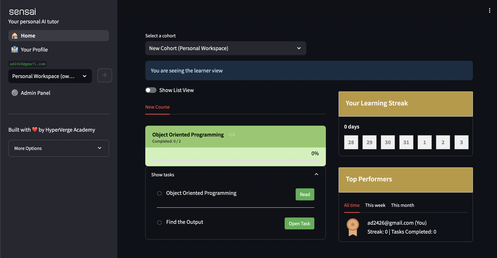

## Create a course

Create a cohort, add learners to it, create a course, add tasks to it and group the tasks under a milestone. 

<AccordionGroup>
<Accordion icon="github" title="Open the admin panel">
    Open the admin panel by clicking on the admin panel button in the sidebar.
    <video
      width="100%"
      height="315"
      controls
      title="Opening the admin panel"
    >
      <source src="./videos/quickstart_1-admin_panel.mp4" type="video/mp4" />
      Your browser does not support the video tag.
    </video>
  </Accordion>
  <Accordion icon="github" title="Create a cohort">
    The course that you will create later will be added to this cohort. A cohort can have learners, mentors and groups. Groups are a way to organize learners. Learn more in the [key concepts](/key_concepts) section.
    <video
      width="100%"
      height="315"
      controls
      title="Creating a cohort"
    >
      <source src="./videos/quickstart_2-create_cohort.mp4" type="video/mp4" />
      Your browser does not support the video tag.
    </video>
  </Accordion>
  <Accordion icon="github" title="Add a learner to the cohort">
    Only learners added to a cohort can access the course.
    <video
      width="100%"
      height="315"
      controls
      title="Adding a learner to the cohort"
    >
      <source src="./videos/quickstart_3-add_member.mp4" type="video/mp4" />
      Your browser does not support the video tag.
    </video>
  </Accordion>
  <Accordion icon="github" title="Create a course">
    You can assign the course to one or more cohorts at the time of creation. Then, you can see the list of cohorts the course is assigned to in the course page and the list of courses in a given cohort in the cohort page. Tasks will be added to the course in the next step.
    <video
      width="100%"
      height="315"
      controls
      title="Creating a course"
    >
      <source src="./videos/quickstart_4-add_course.mp4" type="video/mp4" />
      Your browser does not support the video tag.
    </video>
  </Accordion>
  <Accordion icon="github" title="Create tasks">
    Tasks are the units of work that learners will complete are assigned to one or more courses. There are two types of tasks: `Reading Material` and `Question`. Learn more in the [Tasks](/teachers/tasks) page. We will create one `Reading Material` task and one `Question` task in this step.

    While adding a `Question` type task, you can add a reference answer to it. This is the solution that the AI will use to check if the learner's response is correct. You can even use AI to generate the reference answer for you as shown in the video below.
    <video
      width="100%"
      height="315"
      controls
      title="Creating a cohort"
    >
      <source src="./videos/quickstart_5-add_task.mp4" type="video/mp4" />
      Your browser does not support the video tag.
    </video>
  </Accordion>
  <Accordion icon="github" title="Create a milestone">
    Milestones are used to group tasks together. You need to first create a milestone before you can add tasks to it.
    <video
      width="100%"
      height="315"
      controls
      title="Creating a milestone"
    >
      <source src="./videos/quickstart_6-add_milestone.mp4" type="video/mp4" />
      Your browser does not support the video tag.
    </video>
  </Accordion>
  <Accordion icon="github" title="Group tasks under a milestone">
    You can either assign tasks to a milestone at the time of creating them or you can assign them later by editing the tasks as shown below.
    <video
      width="100%"
      height="315"
      controls
      title="Grouping tasks under a milestone"
    >
      <source src="./videos/quickstart_7-group_tasks.mp4" type="video/mp4" />
      Your browser does not support the video tag.
    </video>
  </Accordion>
</AccordionGroup>

Phew! That was a lot of work. Congratulations! You have created your first course. 🎉

If you go back to your home page now, you will see the course you created along with the tasks grouped under the milestone you created.

## SensAI in action

`Before`: When a learner attempts a question, they are simply told whether their response is correct or not. If they are feeling stuck, they need to find someone who can help them understand where they went wrong.

`Now`: With SensAI, you can let the AI do the heavy lifting for you. As shown in the video below, SensAI will provide a personalized feedback to the learner on their response and nudge them in the right direction.
<video
  width="100%"
  height="315"
  controls
  title="Question type task"
>
  <source src="./videos/quickstart_9-task_question.mp4" type="video/mp4" />
  Your browser does not support the video tag.
</video>

<Accordion icon="github" title="Reading Material">
  The learner can simply read the content given and mark it as complete.
  <video
    width="100%"
    height="315"
    controls
    title="Reading Material type task"
  >
    <source src="./videos/quickstart_8-task_read.mp4" type="video/mp4" />
    Your browser does not support the video tag.
  </video>
</Accordion>

## Next steps

Coming Soon!
